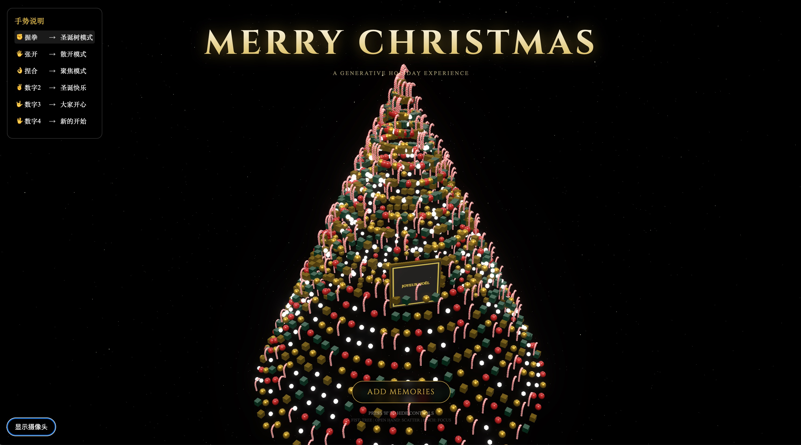
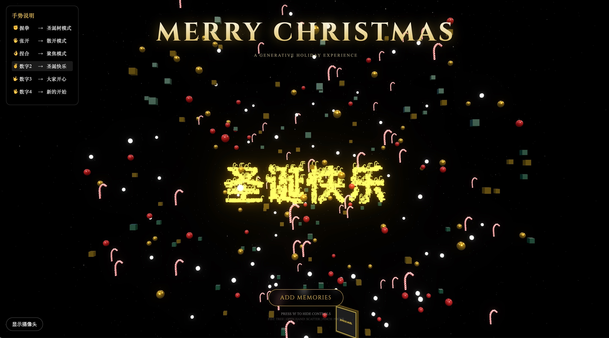

# 🎄 3D Interactive Christmas Tree (3D 交互式圣诞树)

这是一个基于 **React**, **Three.js** 和 **MediaPipe** 构建的 3D 交互式圣诞树项目。通过计算机视觉技术，它允许用户使用手势实时控制 3D 粒子系统，体验从圣诞树到粒子云、照片墙以及文字展示的多种形态变换。

**🌐 在线演示 (Live Demo)**: [https://a-christmas-tree.netlify.app/](https://a-christmas-tree.netlify.app/)

## 🎨 视觉效果 (Visual Effects)

<div align="center">
  
  
</div>

### 1. 3D 圣诞树
粒子沿螺旋线排列，配合不同材质（金属、清漆、发光）的装饰品，在点光源和聚光灯的照射下呈现丰富的质感。

### 2. 泛光特效 (Bloom)
使用 Post-Processing 技术，让高亮部分（如灯光、文字）产生柔和的光晕，增强节日氛围。

### 3. 动态交互
粒子位置、旋转和缩放都通过平滑插值（Lerp）进行过渡，确保模式切换时的流畅体验。

## ✨ 功能特性 (Features)

- **3D 粒子系统**：由 1500+ 个粒子组成的动态系统，可在多种形态间平滑过渡。
- **实时手势交互**：基于 MediaPipe 的高性能手部追踪，支持捏合、握拳、张开等多种手势控制。
- **多模式体验**：
  - 🌲 **Tree Mode**：经典的螺旋圣诞树形态，带有装饰球、糖拐杖和灯光。
  - ✨ **Scatter Mode**：粒子自由散开，形成梦幻的漂浮效果。
  - 📷 **Focus Mode**：照片墙展示，支持手势聚焦查看特定照片。
  - 🔢 **Text Mode**：粒子重组显示数字或文字（如 "2", "3", "4"）。
- **视觉特效**：集成 UnrealBloomPass 泛光效果，营造温暖的节日氛围。
- **照片展示**：支持上传和展示个人照片，自动生成金色相框。

## 🛠️ 技术栈 (Tech Stack)

- **Core**: [React 18](https://react.dev/) + [TypeScript](https://www.typescriptlang.org/)
- **3D Engine**: [Three.js](https://threejs.org/)
- **Computer Vision**: [MediaPipe Tasks Vision](https://developers.google.com/mediapipe/solutions/vision/hand_landmarker)
- **Build Tool**: [Vite](https://vitejs.dev/)

## 🚀 快速开始 (Quick Start)

### 1. 安装依赖

```bash
npm install
```

### 2. 启动开发服务器

```bash
npm run dev
```
访问 `http://localhost:5173` 即可查看效果。

### 3. 构建生产版本

```bash
npm run build
```

## 🖐️ 操作指南 (Operation Guide)

本项目支持以下手势交互。请确保摄像头已授权并保持手部在画面中央。

| 手势图标 | 手势名称 | 触发模式 | 描述 |
| :---: | :--- | :--- | :--- |
| ✊ | **FIST (握拳)** | **Tree Mode** | 粒子聚集成圣诞树形态，恢复默认状态。 |
| 🖐️ | **OPEN (张开)** | **Scatter Mode** | 粒子向四周炸开并漂浮，通过手掌移动控制旋转。 |
| 👌 | **PINCH (捏合)** | **Focus Mode** | 拇指与食指捏合，触发照片聚焦，随机放大一张照片。 |
| ✌️ | **TWO (数字2)** | **Text Mode** | 显示文字 "圣诞快乐"。 |
| 🤟 | **THREE (数字3)** | **Text Mode** | 显示文字 "大家开心"。 |
| 🖖 | **FOUR (数字4)** | **Text Mode** | 显示文字 "新的开始"。 |

> **提示**：
> - 手势识别优先于鼠标悬停。
> - 移动手掌位置可以控制场景的旋转角度。

## ⚙️ 配置说明 (Configuration)

项目提供了丰富的配置项，主要位于 `src/config` 目录下。

### 粒子系统配置 (`src/config/particles.config.ts`)

| 配置项 | 说明 | 默认值 |
| :--- | :--- | :--- |
| `mainParticleCount` | 主粒子数量（树身+装饰） | `1500` |
| `dustParticleCount` | 背景尘埃粒子数量 | `2500` |
| `decorationRatio` | 装饰品（球/方块）占比 | `0.6` |
| `candyCaneRatio` | 糖拐杖占比 | `0.2` |
| `textMap` | 手势对应的文字内容映射 | `{ TWO: '2', ... }` |

### 场景配置 (`src/config/scene.config.ts`)

| 配置项 | 说明 | 默认值 |
| :--- | :--- | :--- |
| `cameraPosition` | 相机初始位置 | `(0, 2, 50)` |
| `bloomStrength` | 泛光强度 | `0.45` |
| `lightColors` | 灯光颜色配置 | `{ pointLight: 0xff7700, ... }` |

### 调整照片角度
如果觉得照片角度不正，可以在 `src/components/Scene3D/index.tsx` 中调整 `targetRotation`：
```typescript
// src/components/Scene3D/index.tsx
targetRotation: new THREE.Euler(0, 0, 0) // 修改这里的 x, y, z 值 (弧度)
```

---

Enjoy your 3D Christmas! 🎄🎅
